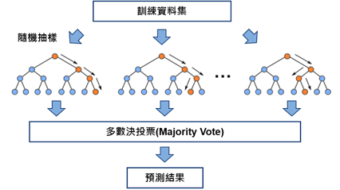

# 資料探勘技術於橋梁健康管理之實務應用研究

## 1. 摘要
本研究利用Python程式語言，依循資料探勘技術流程並使用機器學習模型，用於預測橋梁橋面板(Deck)之健康狀態，以資料科學的角度給予橋梁管理者檢測進行時機上的建議。資料部份主要使用美國聯邦公路總署(Federal Highway Administration, FHWA)所建立之全國橋梁清冊(National Bridge Inventory, NBI)。  
本研究可分為兩部份。前半部著重於建構健康狀態預測模型，先介紹資料前處理與多年度資料整合方法，比較隨機森林模型(Random Forest)的預測結果，並自分類過程中找出重要參數。此外，亦探討投入單次檢測資料與多次資料之表現差異。後半部則著重於預測模型之實務應用，根據模型預測結果建立資料更新規則，將原先之單次預測模型推廣至連續預測。過程中亦測試不同方案下之失誤率與節省資源，輔助橋梁管理者擬定檢修計劃。  

關鍵字：橋梁檢測、資料探勘、機器學習、隨機森林、NBI橋梁資料庫

## 2. 使用模型簡介
### 2.1 隨機森林
隨機森林模型為決策樹Bagging概念的結合。決策樹模型利用內部節點(Internal Node)中之分類條件將資料分類，最終歸類至各葉節點(Leaf Node)，代表一種類別。分類依據使用Breiman et al. (1984)所提出的CART(Classification And Regression Tree)演算法，計算各分支條件下之吉尼不純度(Gini Impurity)，取不純度最低的作為最佳分支方式。  
不純度的公式如下，其中D表節點中的資料總數，Di為節點中屬於第i類別的資料數，k則為類別數。 此外，模型亦可透過吉尼不純度計算出各特徵的重要程度

$$ Gini(D)=1-\sum_{i=1}^k \frac{D_i}{D}^2 $$

Bagging分為Boostrap與Aggregation兩部分，Boostrap為隨機抽樣，自原有資料集中隨機抽取一個較小的資料樣本，取樣過程中每筆資料被抽取的機率相等，也可以重複抽取相同的資料。
抽取出數個小樣本後，各自利用這些樣本中隨機挑選的部份特徵去訓練決策樹模型。
Aggregation代表整合這些小決策樹模型，在預測資料的過程中，每棵決策樹皆會產生其預測的類別，最後透過多數決的方法選出隨機森林模型最後的預測結果。

<!--
### 2.2 深度學習：Entity處理層
深度學習模型多以神經網路為基礎，搭配特殊處理層，達到自動汲取資料特徵的效果。本研究使用的特殊處理層為Entity Embeddings，為一針對類別參數進行轉換的處理層。Entity Embeddings處理將參數中的數值轉換成向量，向量中的數值便可用於表示他們的相似關係。關係較相近的參數彼此間轉換成的向量在空間中也會較靠近，反之則距離較遠。  

下式為參考Lau (2020)文章中所提到向量維度之經驗公式，向量中的數值則與神經網路中之權重相同，可在模型學習的過程中不斷更新。
$$ Vector Size = min(600, 1.5\times round(1.6\times numClass^{0.56}) $$
-->

### 2.2 評估指標
- 常用指標：Accuracy、Precision、Recall
	- 以本研究「預測橋梁是否為缺陷橋」為例，Recall表示模型在實際狀況為缺陷橋的情況下，預測亦為缺陷橋的比例。
	- Recall下降代表許多缺陷橋被誤判成正常橋，若因此跳過檢測使橋梁狀態持續惡化，將使其倒塌的機會大增。因此，Recall為本研究重要評估指標。

- 自定義指標：重大失誤率、資源節省率
	- 將「實際上為缺陷橋，卻被模型誤判為正常橋」定義為重大失誤，並將此失誤數除以當年度缺陷橋總數計算出重大失誤
	- 資源節省率則為模型預測為正常橋、不需進行檢測的數目佔預測年需檢測之總橋數的比例

## 3. 使用資料庫介紹
### 3.1 資料庫架構簡介
- NBI橋梁資料庫，是隸屬於美國聯邦公路總署之公開的資料庫。
- 自1992年起收錄全美52州總計約60萬餘筆的橋梁資訊，包含每座橋梁的基本資料以及現況評估資料共116項參數。
- 其中項目58至60為健康狀態評分項，針對橋梁之橋面版(Deck)、上部結構(Superstructure)與下部結構(Substructure)，分別給予0至9的評分，9為最佳、0為最差，表示完全喪失功能。
- 若有任一構件之狀態評分低於4分，NBI資料庫將此橋認定為結構缺失(Structurally Deficient)之缺陷橋。

###3.2 橋梁檢測頻率
- 一座橋剛要加入資料庫時會進行一次初始檢測，爾後每隔2年進行一次定期檢測，若經允許可延長至4年檢測一次。
- NBI橋梁資料庫每年皆需更新一次，但橋梁並非年年檢測，各橋若當年度未進行檢測，提交年度資料時將沿用過往之檢測資料。

## 4. 資料前處理步驟介紹
1. 篩選當年度資料  
將跨年資料間重複之檢測資料刪除，使各年資料集中僅保留當年度之檢測資料。
2. 刪除缺少必要參數之資料  
定義經緯度、興建年份或改建年份、三項橋梁構件狀態評分為必要參數，刪除缺少任一必要參數之資料。
3. 刪除極端資料  
將橋齡繪成箱型圖，找出極端資料並將其刪除。
4. 刪除不適用參數  
將132項參數中複雜的字串、日期，重複數值超過九成，及手冊中未說明之參數刪除。
5. 缺失值處理  
依參數之資料特性將缺失值填入眾數、中位數、0或是N (No Data)。若缺失值比例超過一半，刪除該項參數。
6. 區分類別參數與數值參數  
將其中紀錄方式為連續數值，且數字大小具比較意義者定義為數值參數，其餘則定義為類別參數。
7.	多年度資料組合  
將跨年度資料組合成一個三維的資料集，各座橋梁某一參數於各年的紀錄統整成表，不同參數各自為分開的資料表。

## 5. 單年度模型預測
### 5.1 題目定義與假設條件
### 5.2 方案擬定
### 5.3 預測結果
### 5.4 重要參數分析

## 6. 連續預測模型
### 6.1 連續預測流程